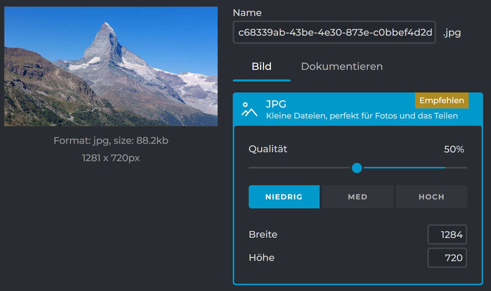
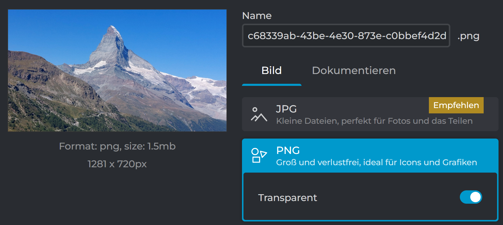
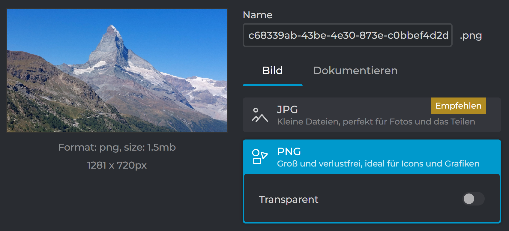

# Farbcodes

## RGB

### FF0000 entspricht der Farbe -> rot

### 00FF00 entspricht der Farbe -> grün

### 0000FF entspricht der Farbe -> blau

### FFFF00 entspricht der Farbe -> gelb

### 00FFFF entspricht der Farbe -> cyan

### FF00FF entspricht der Farbe -> magenta

### 000000 entspricht der Farbe -> schwarz

### FFFFFF entspricht der Farbe -> weiss

### 00BC00 entspricht der Farbe -> dunkel-grün

## CMYK

C:0%, M:100%, Y:100%, K:0%    entspricht der Farbe -> rot
C:100%, M:0%, Y:100%, K:0%    entspricht der Farbe -> grün
C:100%, M:100%, Y:0%, K:0%    entspricht der Farbe -> blau
C:0%, M:0%, Y:100%, K:0%      entspricht der Farbe -> gelb
C:100%, M:0%, Y:0%, K:0%      entspricht der Farbe -> cyan
C:0%, M:100%, Y:0%, K:0%      entspricht der Farbe -> magenta
C:100%, M:100%, Y:100%, K:0%  entspricht der Farbe -> schwarz (in theorie)
C:0%, M:0%, Y:0%, K:100%      entspricht der Farbe -> schwarz
C:0%, M:0%, Y:0%, K:0%        entspricht der Farbe -> weiss
C:0%, M:46%, Y:38%, K:22%     entspricht der Farbe -> dunkeleres rot

## YCbCr

RGB 255/255/255           ergibt in YCbCr      -> 1, 0, 0
RGB 0/0/0                 ergibt in YCbCr      -> 0, 0, 0
Y:1, Cb:0, Cr:0           entspricht der Farbe -> weiss
Y:0, Cb:0, Cr:0           entspricht der Farbe -> schwarz
Y:0, Cb:1, Cr:0           entspricht der Farbe -> rot
Y:0, Cb:-1, Cr:0          entspricht der Farbe -> grün
Y:0, Cb:0, Cr:1           entspricht der Farbe -> blau
Y:0, Cb:0, Cr:-1          entspricht der Farbe -> dunkel grün
Y:0.3, Cb:0.5, Cr:-0.17   entspricht der Farbe -> rot(/braun, bäsch?)

## Aufgabenblock 1: Bildbearbeitung und Transparenz

## Matterhorn Bild

### JPG

### PNG

### Theoretischer Speicherplatz

720 *1281 pixel = 922'320 pixel speichern
922'320 pixel* 8 bit per pixel = 7’378’560 bit
7’378’560 bit = 922'320 Byte
922'320 Byte = ~900 KB
900 KB = ~0.88 MB

JPG braucht weniger Speicher, weil es dieses Bild auch noch verkleinert zu einem gewissemm Grad.
PNG braucht mehr Speicher, weil es das Bild in guter Qualität aufbehaltet.

## Aufgabenblock 2: Bild und Ton

## Berechnen sie den Speicherbedarf für ein unkomprimiertes Einzelbild im HD720p50-Format bei einer True-Color-Farbauflösung. (Die Begriffe HD720p50 und TrueColor bitte googeln)

1280 *720 pixel = 921'000
921'000* 24 (true color) / 8 bit = 2’764’800 Byte
2’764’800 Byte = ~2.6 MB

## Und welchen Speicherbedarf hat das Video aus Aufgabe 1, bei einer Spieldauer von 3 Minuten?

2’764’800 Byte *50 = 138’240’000 per Sekunde
138’240’000* 180 = 24’883’200’000 Bytes
24’883’200’000 Byte = 24’300’000 KB = ~23’730 MB = ~23 GB
