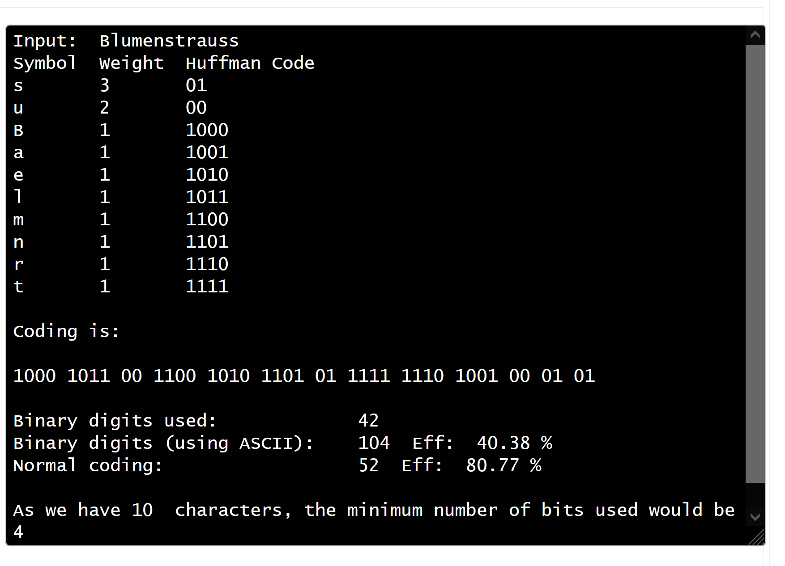

# Komprimierung

## Huffman code

<https://huffman.ooz.ie/>
<https://asecuritysite.com/calculators/huff>

### Wort

Blumenstrauss

### Baum

### Encoded

1000 1011 00 1100 1010 1101 01 1111 1110 1001 00 01 01

## B.1 Verlustlose Komprimierung

Huffman-Algorithmus: (Teamarbeit). Jeder denkt für sich ein Wort mit ca. 15 Buchstaben aus und erstellt dazu die Huffman-Codetabelle und das entsprechend komprimierte Wort in HEX-Darstellung. Nun werden die Codes inklusive der Codetabelle gegenseitig ausgetauscht. Kann ihr Partner ihr gewähltes Wort richtig dekomprimieren?

### Mein Wort ist BANANENKUCHEN

B A N E K U C H
1 2 4 2 1 1 1 1
RLC/E-Verfahren: Sie erhalten diesen RL-Code: Folgendes ist ihnen dazu bekannt: Es handelt sich um eine quadratische Schwarz-Weiss-Rastergrafik mit einer Kantenlänge von 8 Pixel. Es wird links oben mit der Farbe Weiss begonnen. Eine Farbe kann sich nicht mehr als siebenmal wiederholen. Zeichnen sie die Grafik auf. Was stellt sie dar?

010 100 011 110 010 010 010 010 010 010 010 010 010 110 010 110 010 010 010 010 010 010 010 010 001

Das entspricht:

010 2 100 4 011 3 110 6

010 2 010 2 010 2 010 2

010 2 010 2 010 2 010 2

010 2 110 6

010 2 110 6

010 2 010 2 010 2 010 2

010 2 010 2 010 2 010 2

001 1
Als Bild:

0 0|1 1 1 1|0 0 0|1 1 1 1 1 1|0 0|1 1|0 0|1 1|0 0|1 1|0 0|1 1|0 0|1 1 1 1 1 1|0 0|1 1 1 1 1 1|0 0|1 1|0 0|1 1|0 0|1 1|0 0|1 1|0

LZW-Verfahren: Erstellen sie die LZW-Codierung für das Wort «ANANAS» und überprüfen sie mit der Dekodierung ihr Resultat. Danach versuchen sie den erhaltenen LZW-Code «ERDBE<256>KL<260>» zu dekomprimieren.
ANANAS AN<256>AS

ERDBE<256>KL<260> = ERDBEERKLEE

ZIP-Komprimierung: Wir wollen die Effizienz bei der ZIP-Komprimierung untersuchen. Dazu sollen sie ASCII-Textdateien erstellen. Die erste enthält 10, die zweite 100, die dritte 1000, die vierte 10'000 und die fünfte 100'000 ASCII-Zeichen. Achten sie darauf, dass die Zeichen möglichst zufällig gewählt werden. Auf dem Internet findet man entsprechende Textgeneratoren. Kopieren sie jede dieser fünf Textdateien in eine eigene ZIP-Datei. In der Folge erhalten sie fünf ZIP-Dateien. Werten sie nun in einer EXCEL-Tabelle die erforderlichen Speichergrössen aus: ASCII-Datei-Grösse zu ZIP-Datei-Grösse. Versuchen sie nun, ihr Resultat zu interpretieren bzw. zu begründen. Tipp: Sie können in EXCEL Zahlenreihen auch grafisch anzeigen. Nun legen wir noch einen drauf: Erstellen sie eine ASCII-Textdatei mit 100'000 Zeichen. Diemal aber nicht random-befüllt, sondern ausschliesslich mit dem Buchstaben A, danach zippen sie. Vergleichen sie nun die beiden ZIP-Dateien. Wie erklären sie sich den Unterschied der Speichergrössen? Zu guter letzt wollen wir untersuchen, was die ZIP-Komprimierung bringt, wenn die Originaldatei, wie beim JPG-Bildformat, bereits komprimiert (DCT) vorliegt. Dazu erhalten sie die zwei folgenden Bilder: ZIPTestHi.jpg und ZIPTestLo.jpg Gehen sie nun gleich vor, wie beim vorangegangenen Untersuch der Textdateien. Begründen sie ihr Resultat.

BWT (Burrows-Wheeler-Transformation): Bei diesem Verfahren wird das Original mit ein paar Tricks so umgestellt, dass danach RLC/E seine volle Wirkung entfalten kann. Suchen sie im Internet nach Informationen zu diesem Verfahren. Lösen sie nun die folgenden beiden Aufgaben: Erstellen sie die BWT-Transformation für das Wort ANANAS und überprüfen sie mit der rücktransformation ihr Resultat. Sie erhalten den Code IICRTGH6 in der Burrows-Wheeler-Transformation. Welches Wort verbirgt sich dahinter?

## B.2 Verlustbehaftete Komprimierung
